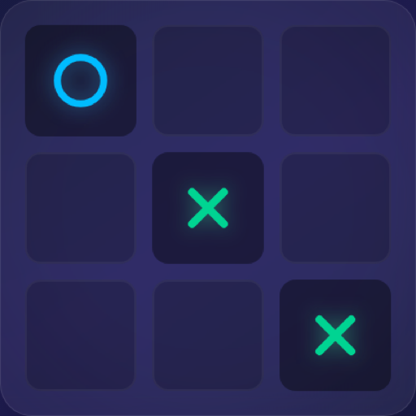

<div align="center">
  
  <h1>🎮 Tic-Tac-Toe</h1>
  <p><strong>A modern, real-time multiplayer Tic-Tac-Toe experience built with TanStack Start.</strong></p>

  <h3><a href="https://ttt.erlich.dev/">▶️ Play Live Demo</a></h3>

  <p>
    
    
    
    
    
  </p>
</div>

---

## ✨ Features

- **🤖 Single Player vs. Bot** — Sharpen your skills against an intelligent computer opponent.
- **🌐 Real-time Multiplayer** — Challenge your friends instantly via built-in WebSocket matchmaking.
- **🔄 Rematch System** — Keep the games going! Send and accept rematch requests seamlessly.
- **⌨️ Keyboard Accessible** — Navigate the board entirely with arrow keys or **Vim bindings** (`h`, `j`, `k`, `l`).
- **💅 Beautiful UI/UX** — Crafted with Tailwind CSS v4 for a premium, responsive, and glassmorphic look.
- **🧪 Robust TDD Foundation** — Ensured reliability with comprehensive Playwright E2E tests and Vitest.
- **⚡ Blazing Fast** — Powered by Vite and TanStack Start for lightning-fast HMR and server-side rendering optimizations.

## 🛠 Tech Stack

| Category | Technology |
| --- | --- |
| **Frontend** | React 19, TypeScript |
| **Framework** | TanStack Start, TanStack Router |
| **Styling** | Tailwind CSS v4, Lucide Icons |
| **Backend/API** | Nitro (WebSocket handlers, API routes) |
| **Tooling** | Vite, Biome (Linting/Formatting) |
| **Testing** | Playwright (E2E), Vitest (Unit) |

## 🚀 Getting Started

Follow these steps to get the project running locally on your machine.

### Prerequisites

- [Node.js](https://nodejs.org/) (v20+ recommended)
- [npm](https://www.npmjs.com/) 

### Installation

1. **Clone the repository**
   ```bash
   git clone https://github.com/eddierl/tic-tac-toe.git
   cd tic-tac-toe
   ```

2. **Install dependencies**
   ```bash
   npm install
   ```

3. **Start the development server**
   ```bash
   npm run dev
   ```
   > The server will start at `http://localhost:3000`. WebSockets and API routes run on the same Nitro server instance.

## 🎮 How to Play

### Single Player
Simply launch the game, select "Play vs Bot", and try to outsmart the computer. 

### Multiplayer
1. Click **Play with Friend**.
2. Share your screen or have a friend join on the same network.
3. WebSockets automatically pair you up when a match is found!

### Keyboard Controls
- **Arrows / Vim (`h`, `j`, `k`, `l`)**: Move around the grid.
- **Enter / Space**: Place your symbol (X or O).
- **Tab**: Focus interactive buttons.

## 📦 Scripts

- `npm run dev` — Starts the Vite development server.
- `npm run build` — Builds the app for production.
- `npm run preview` — Previews the production build locally.
- `npm run test` — Runs Vitest test suites.
- `npm run lint` — Runs Biome checks.
- `npm run format` — Auto-formats code with Biome.
- `npm run gen:favicon` — Generates app logos and favicon via Playwright screenshot.

## 🤝 Contributing

Contributions are welcome! Please feel free to submit a Pull Request.
1. Fork the project
2. Create your feature branch (`git checkout -b feature/AmazingFeature`)
3. Commit your changes (`git commit -m 'Add some AmazingFeature'`)
4. Push to the branch (`git push origin feature/AmazingFeature`)
5. Open a Pull Request

---

<div align="center">
  <sub>Built with ❤️ by Eddie Erlich and the Open Source Community</sub>
</div>
